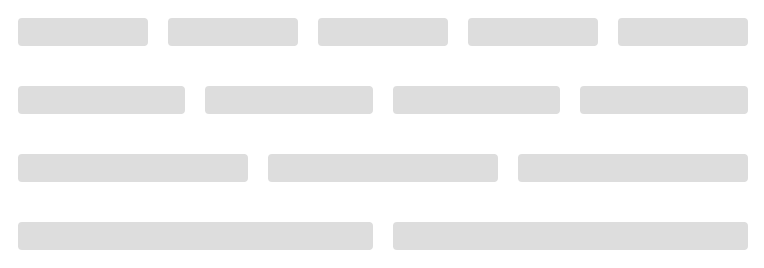

# YDWeb SCSS样式与组件说明文档


## Basic
### Color

> 主色


```SCSS
$mainColor: #FF8819;  //主色
$graydarker: #333;
$graydark: #666;
$gray: #DDD;
$grayLight: #F5F5F5;
$white: #FFF;
```

> 辅助色


### variable(待完善)
#### global

> 定义了包含字体、背景色、间隔距等常用的全局变量 

```SCSS
<!-- font family -->
$YdGlobalFontCN: "Lantinghei SC", "Microsoft YaHei", "微软雅黑", "宋体";
$YdGlobalFontEN: Verdana, Arial, Helvetica, "san-serif";
$YdGlobalFontDefault: PingFang SC,Lantinghei SC,Helvetica Neue,Helvetica,Arial,Microsoft YaHei,\\5FAE\8F6F\96C5\9ED1,STHeitiSC-Light,simsun,\\5B8B\4F53,WenQuanYi Zen Hei,WenQuanYi Micro Hei,'sans-serif';
$YdGlobalFontSize15: 15px;
$YdGlobalFontSize14: 14px;  // 默认字体14px
$YdGlobalFontSize13: 13px;
$YdGlobalFontSize12: 12px;  // 二级字体12px

<!-- page -->
$pageDefaultBackgroundColor:#F6F6F6;
$headerDefaultBackgroundColor:#FFFFFF;

<!-- gap间隔 -->
$gap12: 12px;
$gap15: 15px;
$gap22: 22px;

<!-- radius -->
$baseRadius:2px;

<!-- size -->
$pageDefaultWidth:1000px;
```
#### button

> 定义button常用的变量

```SCSS
<!-- button padding -->
$YdBtnPadH: 7px;
$YdBtnPadV: 7px;

<!-- button bg -->
$YdBtnDisableBg: $gray;
$YdBtnDefaultBg: $white;
$YdBtnprimaryBg: $mainColor;
$YdBtnprimaryActiveBg: rgba($mainColor, .8);

<!-- button height -->
$YdBtnHeightDefault: 34px;
$YdBtnLineHeightDefault: 34px;
$YdBtnHeightMax: 38px;
$YdBtnLineHeightMax: 38px;

<!-- button color  -->
$YdBtnFontColorDisable: $graydark;
$YdBtnFontColorDefault: $mainColor;
$YdBtnFontColorPrimary: $white;
$YdBtnFontColorPrimaryActive: rgba(255, 255, 255, .8);

<!-- button size -->
$YdBtnFontSize: $YdGlobalFontSize14;
$YdBtnBorderRadius: $baseRadius;
```

### mixin

!> 注：由于mixin函数代码比较多，所以文档只包含了mixin的调用方法，如需查看，请点击[mixin](https://github.com/DF-teenager/ydweb-scss)

#### grid

> 栅格布局，默认宽度为1000px的布局，每个栅格为65px，共12个，计算公式：(65+20)*12-20 = 1000，支持固定宽度和百分比宽度。

```SCSS
// ===============================================
// 里面定义了width，左右margin及左浮动。
// 可传入两个参数$i，$subtract（可选，默认为0）。
// ===============================================

@mixin column($i: $gridColumns, $subtract:0){
  // 解决当$i 小于$gridColumns的时候需要float
  @if $i < $gridColumns {
    @extend %float;
  }
  @extend %margin-gutter;

  $getWidth: getWidth($i, true, $subtract); // Use the width calculation function to get the width 
  width: $getWidth;

  @if $gridPercentSwitch and $lte7{
    *width:$getWidth - $gridCorrection;
  } 
}

// ================================================================================
// wrapper里面定义了宽度，清除子元素浮动，及是否水平居中。
// 可传入三个参数：$i，$center（可选，默认为true），$subtract（可选，默认为0）。
// ================================================================================

@mixin wrapper($i: $gridColumns, $center:true, $subtract:0){
  @extend %clearfix;
  
  $getWrapperWidth: getWidth($i, false);
  $wrapperWidth: $getWrapperWidth - $subtract;
  width:$wrapperWidth;

  @if $center == true {
    margin-left:auto;
    margin-right:auto;
  }
}
```
!> 注：关于栅格布局的使用在后面的widget中会有详细的说明。

#### badge(徽章)

> 出现在债权项目、按钮旁的状态标记或数字（待完善）

```html
<div class="badge-block">
    <span class="badge color-i-prj-cate-1">新</span>
    <span class="badge color-i-prj-cate-2">直</span>
    <span class="badge color-i-prj-cate-5">保</span>
    <span class="badge color-i-prj-cate-3">车</span>
    <span class="badge color-i-prj-cate-4">微</span>
    <span class="badge color-i-prj-cate-6">新</span>
</div>
```

```SCSS
<!-- 调用方式 -->

// ==================徽章==================
// 使用时父元素需添加相对定位relative
// 参数1：背景颜色 background
// 参数2：元素的宽度width
// 参数3：元素的高度height
// 参数4：定位位置 left or right
// 参数5：定位距Top的距离
// 参数6：定位距Left or right的距离（参数2定位位置决定）
// 参数7：元素的padding-top（可选）
// 参数8：元素字体大小（可选）
// ========================================
<!-- 单badge -->
.badge{
	@include badge(20px, 20px, left, -1px, 15px, 4px)
}
<!-- 双badge -->
.badge.double{
	@include badge(20px, 20px, left, -1px, 41px, 4px)
}
<!-- 多badge -->
.badge.triple{
	@include badge(20px, 20px, left, -1px, 67px, 4px)
} 
```
##### ●RESULT


!> 注：可结合需求添加自定义样式或传递样式参数。

#### arrow(箭头)

> 常用在下拉菜单、提示款(tips)、更多(link)的小三角icon

```html
<div class="arrow-block">
    <i class="element arrow_top"></i>
    <i class="element arrow_right"></i>
    <i class="element arrow_bottom"></i>
    <i class="element arrow_left"></i>
</div>
```

```SCSS
 <!-- 调用方式 -->

// ===================箭头===================
// 参数1 宽度 width
// 参数2 边框宽度 border-width
// 参数3 箭头方向 direction: top bottom left right
// 参数4 边框颜色 color
// 参数5 背景颜色 background-color
// 参数6 定位置 position 默认relative
// ==========================================

<!-- 上 -->
.arrow_top{
	@include arrow(5px, 1px, 'top', $graydark, $white) 
}
<!-- 右 -->
.arrow_right{
	@include arrow(5px, 1px, 'right', $graydark, $white) 
}
<!-- 下 -->
.arrow_bottom{
	@include arrow(5px, 1px, 'bottom', $graydark, $white) 
}
<!-- 左 -->
.arrow_left{
	@include arrow(5px, 1px, 'left', $graydark, $white) 
}
```
##### ●RESULT


!> 注：同badge，可结合需求添加自定义样式或传递样式参数。

#### box-sizing

> box-sizing盒子模型，ie8+支持

```SCSS
 <!-- 调用方式 -->

.boxModel{
	@include box-sizing(border-box);
}
```

# 基础组件(widget)

## Basic
### Layout 布局

> 通过基础的 12 分栏，迅速简便地创建布局。默认宽度为1000px，每个栅格为65px，共12个，计算公式：(65+20)*12-20 = 1000。

```html
<div class="layout-block prj-1">
    <div class="element"></div>
    <div class="element"></div>
    <div class="element"></div>
    <div class="element"></div>
    <div class="element"></div>
</div>
<div class="layout-block prj-2">
    <div class="element"></div>
    <div class="element"></div>
    <div class="element"></div>
    <div class="element"></div>
</div>
<div class="layout-block prj-3">
    <div class="element"></div>
    <div class="element"></div>
    <div class="element"></div>
</div>
<div class="layout-block prj-4">
    <div class="element"></div>
    <div class="element"></div>
</div>
```

```SCSS
.layout-block{
	// @include comm1000(68px, $white)
	height: 68px;
	@include wrapper(9,true,9);
	.element{
		height: 28px;
		border-radius: $baseRadius + 2px;
		background: $gray;
	}
	&.prj-1 .element{
		@include column(2, 20px);
		<!-- 设置栅格间隔大小，如果不需要间隔，可设置margin:0; -->
		// margin: 0;
	}
	&.prj-2 .element{
		@include column(2, -17.5px);
	}
	&.prj-3 .element{
		@include column(3, 5px);
	}
	&.prj-4 .element{
		@include column(4, -35px);
	}
}
```
#### ●RESULT



!> column和wrapper的区别在于：column一般用于子元素，有浮动和margin左右，所以计算宽度时设置$onlyInnerWidth为true，即减掉左右的margin，而wrapper一般用于父元素，得用来闭合子元素的浮动，然后可能会需要居中对齐，所以计算宽度时设置$onlyInnerWidth为false。当然宽度不可能每次都是恰好的，所有有了$subtract来微调，你也可以根据你的项目直接使用getWidth这个函数，而不必使用这些mixin什么的，关键在于灵活运用。<br/><br/>可通过margin单独设置元素element之间的间隔。

### button 按钮

```html
<div class="button-block">
    <a class="btn primary" href="javascript:void(0);">我是按钮primary</a>
    <a class="btn unprimary" href="javascript:void(0);">我是按钮unprimary</a>
    <a class="btn reder" href="javascript:void(0);">我是按钮reder</a>
    <a class="btn graybtn" href="javascript:void(0);">我是按钮graybtn</a>
    <a class="btn default primary" href="javascript:void(0);">我是按钮b_primary</a>
    <a class="btn default unprimary" href="javascript:void(0);">我是按钮b_unprimary</a>
    <a class="btn default reder" href="javascript:void(0);">我是按钮b_reder</a>
    <a class="btn disable" href="javascript:void(0);">我不能点disable</a>
</div>
```
#### ●RESULT


!> 注：如果button不能满足需求，可通过自定义样式覆盖即可。

## From
### Radio 单选框

> 在一组备选项中进行单选

```html
<div class="input-select-ydwap">
    <div class="input-select clearfix">
        <div class="radio-block fl">
            <input type="radio" id="radio_1">
            <label class="icon-label" for="radio_1">
                <i class="buycar-ydwap right_small"></i>
            </label>
        </div>
        <div class="radio-block fl">
            <input type="radio" id="radio_1">
            <label class="icon-label" for="radio_1">
                <i class="buycar-ydwap right_small"></i>
            </label>
            <label for="radio_1">适用8折券</label>
        </div>
        <div class="radio-block selected fl">
            <input type="radio" id="radio_1">
            <label class="icon-label" for="radio_1">
                <i class="buycar-ydwap right_small"></i>
            </label>
            <label for="radio_1">适用8折券</label>
        </div>
    </div>
</div>
```

#### ●RESULT


!> 注：单选框如需行显示，在class为radio-block元素上添加fl属性即可，说明文字为可选。


### Checkbox 多选框

> 一组备选项中进行多选，多用于购物车

```html
<!-- 不带文字 -->
<div class="input-select clearfix">
    <div class="checkbox-block fl">
        <input type="checkbox" id="checkbox_2" class="ydcheckbox">
        <label for="checkbox_2">
            <i class="buycar-yd checked"></i>
        </label>
    </div>
    <div class="checkbox-block fl">
        <input type="checkbox" id="checkbox_2" class="ydcheckbox">
        <label for="checkbox_2">
            <i class="buycar-yd checked"></i>
        </label>
    </div>
    <div class="checkbox-block selected fl">
        <input type="checkbox" id="checkbox_2" class="ydcheckbox">
        <label for="checkbox_2">
            <i class="buycar-yd checked"></i>
        </label>
    </div>
</div>

<!-- 带文字 -->
<div class="input-select clearfix">
    <div class="checkbox-text-block fl">
        <input type="checkbox" class="ydcheckbox" id="select-text-1">
        <label class="label-icon" for="select-text-1">
            <i class="buycar-yd checked"></i>
        </label>
        <label for="select-text-1">椰子</label>
    </div>
    <div class="checkbox-text-block fl">
        <input type="checkbox" class="ydcheckbox" id="select-text-2">
        <label class="label-icon" for="select-text-2">
            <i class="buycar-yd checked"></i>
        </label>
        <label for="select-text-2">芒果</label>
    </div>
    <div class="checkbox-text-block selected fl">
        <input type="checkbox" class="ydcheckbox" id="select-text-3">
        <label class="label-icon" for="select-text-3">
            <i class="buycar-yd checked"></i>
        </label>
        <label for="select-text-3">香蕉</label>
    </div>
</div>
```

#### ●RESULT


!> 注：多选框如需行显示，同单选框需在class为checkbox-block的元素添加fl属性即可；如需有文字说明，需修改class为checkbox-text-block。

### Input 输入框（待更新）

## Data
### Progress

> 用于展示操作进度，告知用户当前状态和预期。

```html
<div class="progress-block">
    <div class="progress">
        <div class="progress-ele">
            <div class="item ele-primary"></div>
            <div class="item ele-disable"></div>
            <div class="item ele-default"></div>
        </div>
        <div class="progress-data clearfix">
            <span class="item ele-percent">66%</span>
            <span class="item ele-desc">购买次日计息，次日起可退</span>
            <span class="item ele-money">132万/200万</span>
        </div>
    </div>
</div>
```
#### ●RESULT

