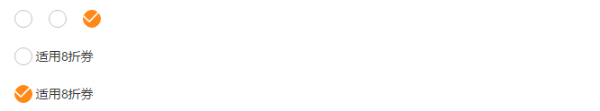

# YDWeb SCSS样式与组件说明文档

# 样式说明

## Basic
### Color

> 主色


> 辅助色


### variable

### mixin

!> 注：由于mixin函数代码比较多，所以文档只包含了mixin的调用方法，如需查看，请点击[mixin](https://github.com/DF-teenager/ydweb-scss)

#### badge(徽章)

> 出现在债权项目、按钮旁的状态标记或数字（待完善）

```html
<div class="badge-block">
    <span class="badge color-i-prj-cate-1">新</span>
    <span class="badge color-i-prj-cate-2">直</span>
    <span class="badge color-i-prj-cate-5">保</span>
    <span class="badge color-i-prj-cate-3">车</span>
    <span class="badge color-i-prj-cate-4">微</span>
    <span class="badge color-i-prj-cate-6">新</span>
</div>
```

```SCSS
<!-- 调用方式 -->

// ==================徽章==================
// 使用时父元素需添加相对定位relative
// 参数1：背景颜色 background
// 参数2：元素的宽度width
// 参数3：元素的高度height
// 参数4：定位位置 left or right
// 参数5：定位距Top的距离
// 参数6：定位距Left or right的距离（参数2定位位置决定）
// 参数7：元素的padding-top（可选）
// 参数8：元素字体大小（可选）
// ========================================
<!-- 单badge -->
.badge{
	@include badge(20px, 20px, left, -1px, 15px, 4px)
}
<!-- 双badge -->
.badge.double{
	@include badge(20px, 20px, left, -1px, 41px, 4px)
}
<!-- 多badge -->
.badge.triple{
	@include badge(20px, 20px, left, -1px, 67px, 4px)
} 
```
##### ●RESULT


!> 注：可结合需求添加自定义样式或传递样式参数。

#### arrow(箭头)

> 常用在下拉菜单、提示款(tips)、更多(link)的小三角icon

```html
<div class="arrow-block">
    <i class="element arrow_top"></i>
    <i class="element arrow_right"></i>
    <i class="element arrow_bottom"></i>
    <i class="element arrow_left"></i>
</div>
```

```SCSS
 <!-- 调用方式 -->

// ===================箭头===================
// 参数1 宽度 width
// 参数2 边框宽度 border-width
// 参数3 箭头方向 direction: top bottom left right
// 参数4 边框颜色 color
// 参数5 背景颜色 background-color
// 参数6 定位置 position 默认relative
// ==========================================

<!-- 上 -->
.arrow_top{
	@include arrow(5px, 1px, 'top', $graydark, $white) 
}
<!-- 右 -->
.arrow_right{
	@include arrow(5px, 1px, 'right', $graydark, $white) 
}
<!-- 下 -->
.arrow_bottom{
	@include arrow(5px, 1px, 'bottom', $graydark, $white) 
}
<!-- 左 -->
.arrow_left{
	@include arrow(5px, 1px, 'left', $graydark, $white) 
}
```
##### ●RESULT


!> 注：同badge，可结合需求添加自定义样式或传递样式参数。

#### box-sizing

> box-sizing盒子模型，ie8+支持

```SCSS
 <!-- 调用方式 -->

.boxModel{
	@include box-sizing(border-box);
}
```

# 基础组件

## From
### Radio 单选框

> 在一组备选项中进行单选

```html
<div class="input-select-ydwap">
    <div class="input-select clearfix">
        <div class="radio-block fl">
            <input type="radio" id="radio_1">
            <label class="icon-label" for="radio_1">
                <i class="buycar-ydwap right_small"></i>
            </label>
        </div>
        <div class="radio-block fl">
            <input type="radio" id="radio_1">
            <label class="icon-label" for="radio_1">
                <i class="buycar-ydwap right_small"></i>
            </label>
            <label for="radio_1">适用8折券</label>
        </div>
        <div class="radio-block selected fl">
            <input type="radio" id="radio_1">
            <label class="icon-label" for="radio_1">
                <i class="buycar-ydwap right_small"></i>
            </label>
            <label for="radio_1">适用8折券</label>
        </div>
    </div>
</div>
```

#### ●RESULT



!> 注：单选框如需行显示，在class为radio-block元素上添加fl属性即可，说明文字为可选。


### Checkbox 多选框

> 一组备选项中进行多选，多用于购物车

```html
<!-- 不带文字 -->
<div class="input-select clearfix">
    <div class="checkbox-block fl">
        <input type="checkbox" id="checkbox_2" class="ydcheckbox">
        <label for="checkbox_2">
            <i class="buycar-yd checked"></i>
        </label>
    </div>
    <div class="checkbox-block fl">
        <input type="checkbox" id="checkbox_2" class="ydcheckbox">
        <label for="checkbox_2">
            <i class="buycar-yd checked"></i>
        </label>
    </div>
    <div class="checkbox-block selected fl">
        <input type="checkbox" id="checkbox_2" class="ydcheckbox">
        <label for="checkbox_2">
            <i class="buycar-yd checked"></i>
        </label>
    </div>
</div>

<!-- 带文字 -->
<div class="input-select clearfix">
    <div class="checkbox-text-block fl">
        <input type="checkbox" class="ydcheckbox" id="select-text-1">
        <label class="label-icon" for="select-text-1">
            <i class="buycar-yd checked"></i>
        </label>
        <label for="select-text-1">椰子</label>
    </div>
    <div class="checkbox-text-block fl">
        <input type="checkbox" class="ydcheckbox" id="select-text-2">
        <label class="label-icon" for="select-text-2">
            <i class="buycar-yd checked"></i>
        </label>
        <label for="select-text-2">芒果</label>
    </div>
    <div class="checkbox-text-block selected fl">
        <input type="checkbox" class="ydcheckbox" id="select-text-3">
        <label class="label-icon" for="select-text-3">
            <i class="buycar-yd checked"></i>
        </label>
        <label for="select-text-3">香蕉</label>
    </div>
</div>
```

#### ●RESULT


!> 注：多选框如需行显示，同单选框需在class为checkbox-block的元素添加fl属性即可；如需有文字说明，需修改class为checkbox-text-block。

